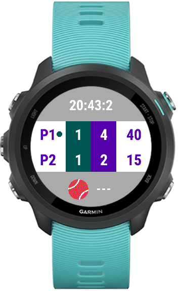

# TennisScore

**TennisScore** is an app designed for Garmin watches that allows users to track the score of a tennis match directly from their wrist. It provides an easy way to monitor the game without needing to rely on external devices or paper scorecards.

## Features

- **Score Tracking**: The app tracks points, games, and sets for both players.
- **Tiebreaks**: Displays tiebreak points when a tiebreak is played.
- **Serve Indicator**: Shows which player is serving by displaying a small tennis ball icon next to their name.
- **Health Data**: Displays the current time and the user's heart rate during the match.

## Controls

- **Up Button**: Press to increment Player 1's score by one point.
- **Down Button**: Press to increment Player 2's score by one point.
- **Start Button**: Press to restore the previous score if an error was made.
- **Back Button**: Press to exit the app.

## Installation

