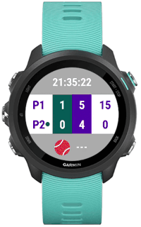

#  TennisScore

**TennisScore** is an app designed for Garmin watches that allows users to track the score of a tennis match directly from their wrist. It provides an easy way to monitor the game without needing to rely on external devices or paper scorecards.

## Features

- **Score Tracking**: The app tracks points, games, and sets for both players.
- **Tiebreaks**: Displays tiebreak points when a tiebreak is played.
- **Serve Indicator**: Shows which player is serving by displaying a small tennis ball icon next to their name.
- **Health Data**: Displays the current time and the user's heart rate during the match.

## Controls

- **Up Button**: Press to increment Player 1's score by one point.
- **Down Button**: Press to increment Player 2's score by one point.
- **Start Button**: Press to restore the previous score if an error was made.
- **Back Button**: Press to exit the app.

## Installation via GitHub

1. Go to the [Release section](https://github.com/syme84/TennisScore/releases) of this GitHub repository.
2. Download the `TennisScore.prg` file.
3. Transfer the `.prg` file to your Garmin watch. You can do this either using Garmin Express or by manually copying the file to the correct folder on your watch using a file manager.

**Note:** Make sure your Garmin watch supports the installation of custom apps. You will need a Garmin device that supports Connect IQ.

## Feedback, Bug Reports, and Contributions

We welcome any feedback, bug reports, or suggestions for improving the **TennisScore** app. Your input helps make the app better for everyone!

- **Bug Reports**: If you encounter any bugs or issues while using the app, please report them by opening an issue in the [GitHub Issues](https://github.com/YOURUSERNAME/TennisScore/issues) section of this repository. Provide as much detail as possible, including steps to reproduce the issue if applicable.
  
- **Suggestions**: If you have any suggestions for new features or improvements, feel free to share them! Open an issue or create a pull request with your ideas.

- **Code Quality**: Please note that the code is not perfect, and there may be areas that need improvement. Feel free to submit pull requests with bug fixes, code refactoring, or new features.

### How to Report a Bug:
1. Go to the [Issues](https://github.com/syme84/TennisScore/issues) tab of the repository.
2. Click on **New Issue**.
3. Fill out the issue template with relevant information about the bug you encountered.
4. Submit the issue, and I’ll look into it as soon as possible.

Your contributions are highly appreciated!

### Note on GitHub Usage

I’m still gaining experience with GitHub and open-source development. While I’m doing my best to keep everything organized and maintain the project, there may be areas where I’m still learning. If you notice any mistakes, inconsistencies, or areas for improvement in how the repository is managed, feel free to point them out! Your patience and understanding are greatly appreciated as I continue to improve my GitHub skills.

